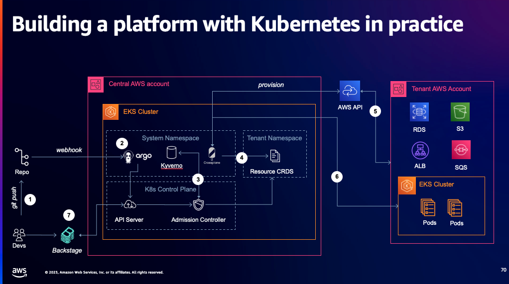
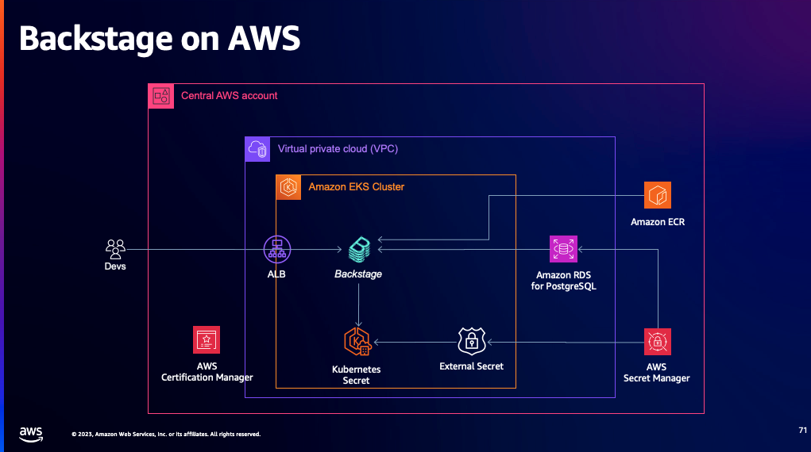
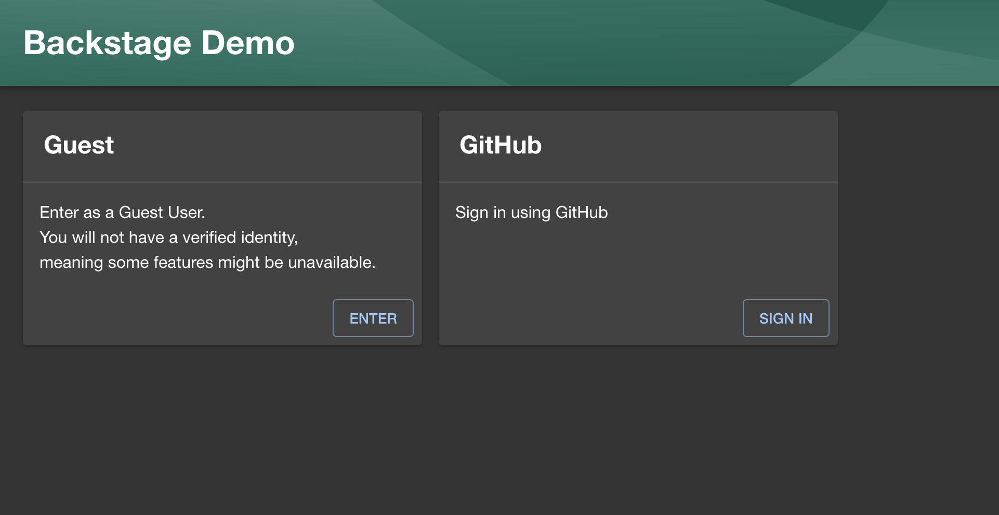
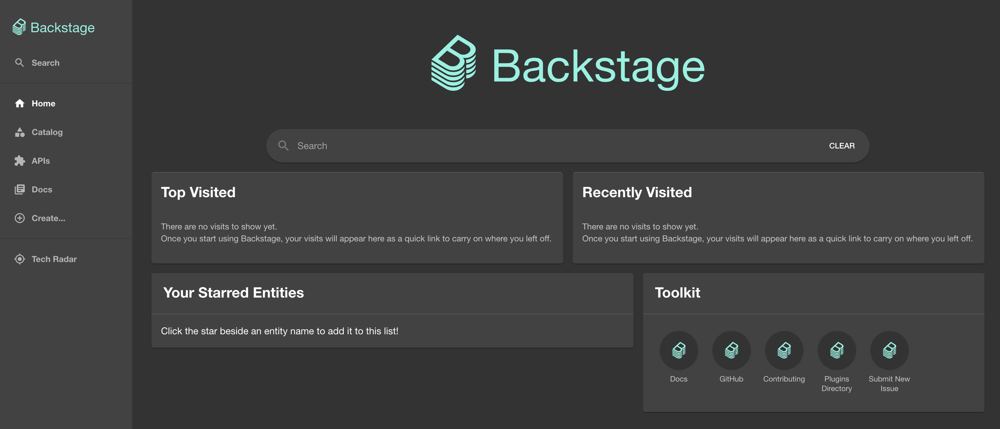
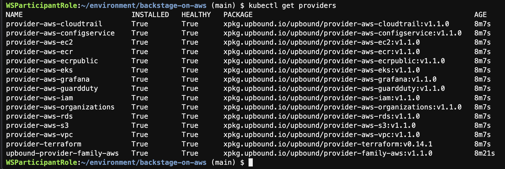
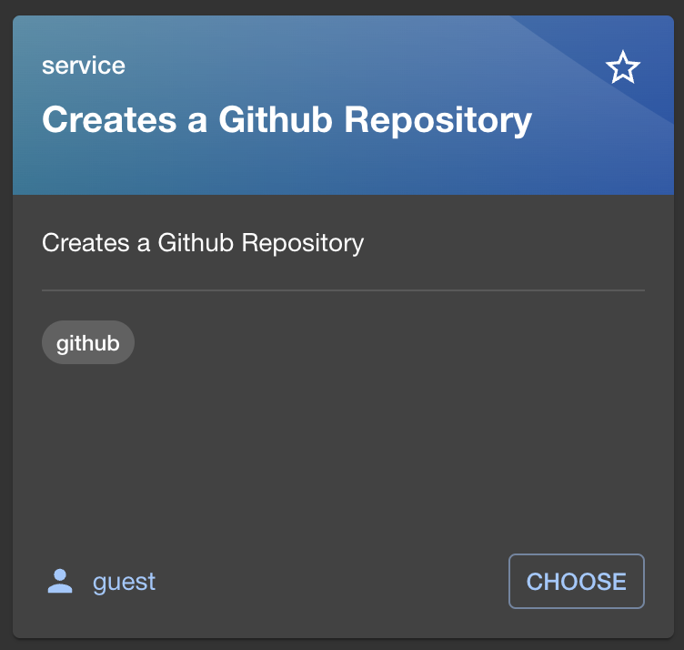
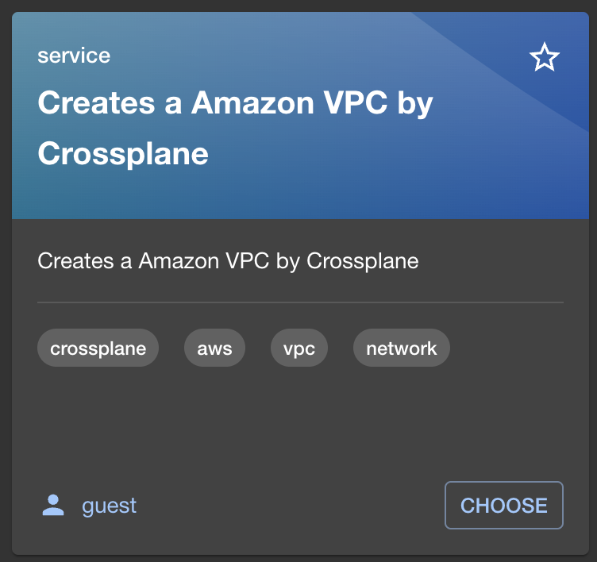
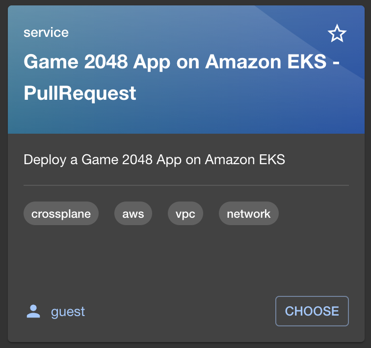

# Backstage on AWS


Platform engineering has emerged in response to the growing complexity of cloud native and the challenge of scaling DevOps to the enterprise. During this repository, we’ll dive into:

1. Building a platform with Kubernees in practice. 
2. How to combine Amazon EKS, Backstage, Argo CD, Kyverno and Crossplane in a platform your developers will love to use.



For Backstage on AWS's architecture components of the Amazon EKS, Amazon ECR, Amazon RDS for Postgresql, AWS Secret Manager and AWS ACM.



## Preparation

The following prerequisites are required to complete this workshop:

- Github Personal Token. see how to [Managing your personal access tokens](https://docs.github.com/en/enterprise-server@3.9/authentication/keeping-your-account-and-data-secure/managing-your-personal-access-tokens)
- Github OAuth app `Client ID` and `Client Secret`. see how to [Creating an OAuth app](https://docs.github.com/en/apps/oauth-apps/building-oauth-apps/creating-an-oauth-app)
- A computer with an internet connection running Microsoft Windows, Mac OSX, or Linux.
- An internet browser such as Chrome, Firefox, Safari, Opera, or Edge.
- Access to an email account to login to Workshop Studio.

## Getting started (Platform Engineer View)

### AWS Cloud9 Setup

In this section we are going to familiarize ourselves with the Cloud9 environment that has been provisioned and pre-configured. AWS Cloud9 is a cloud-based integrated development environment (IDE) that lets you write, run, and debug your code with just a browser.

Navigate to the Cloud9 console . There is a Cloud9 environment provisioned named `CDKDEV`. Click Open.

- Resize an Amazon EBS volume that an environment uses

```
#!/bin/bash

# Specify the desired volume size in GiB as a command line argument. If not specified, default to 20 GiB.
SIZE=${1:-20}

# Get the ID of the environment host Amazon EC2 instance.
TOKEN=$(curl -s -X PUT "http://169.254.169.254/latest/api/token" -H "X-aws-ec2-metadata-token-ttl-seconds: 60")
INSTANCEID=$(curl -s -H "X-aws-ec2-metadata-token: $TOKEN" -v http://169.254.169.254/latest/meta-data/instance-id 2> /dev/null)
REGION=$(curl -s -H "X-aws-ec2-metadata-token: $TOKEN" -v http://169.254.169.254/latest/meta-data/placement/region 2> /dev/null)

# Get the ID of the Amazon EBS volume associated with the instance.
VOLUMEID=$(aws ec2 describe-instances \
  --instance-id $INSTANCEID \
  --query "Reservations[0].Instances[0].BlockDeviceMappings[0].Ebs.VolumeId" \
  --output text \
  --region $REGION)

# Resize the EBS volume.
aws ec2 modify-volume --volume-id $VOLUMEID --size $SIZE

# Wait for the resize to finish.
while [ \
  "$(aws ec2 describe-volumes-modifications \
    --volume-id $VOLUMEID \
    --filters Name=modification-state,Values="optimizing","completed" \
    --query "length(VolumesModifications)"\
    --output text)" != "1" ]; do
sleep 1
done

# Check if we're on an NVMe filesystem
if [[ -e "/dev/xvda" && $(readlink -f /dev/xvda) = "/dev/xvda" ]]
then
# Rewrite the partition table so that the partition takes up all the space that it can.
  sudo growpart /dev/xvda 1
# Expand the size of the file system.
# Check if we're on AL2 or AL2023
  STR=$(cat /etc/os-release)
  SUBAL2="VERSION_ID=\"2\""
  SUBAL2023="VERSION_ID=\"2023\""
  if [[ "$STR" == *"$SUBAL2"* || "$STR" == *"$SUBAL2023"* ]]
  then
    sudo xfs_growfs -d /
  else
    sudo resize2fs /dev/xvda1
  fi

else
# Rewrite the partition table so that the partition takes up all the space that it can.
  sudo growpart /dev/nvme0n1 1

# Expand the size of the file system.
# Check if we're on AL2 or AL2023
  STR=$(cat /etc/os-release)
  SUBAL2="VERSION_ID=\"2\""
  SUBAL2023="VERSION_ID=\"2023\""
  if [[ "$STR" == *"$SUBAL2"* || "$STR" == *"$SUBAL2023"* ]]
  then
    sudo xfs_growfs -d /
  else
    sudo resize2fs /dev/nvme0n1p1
  fi
fi
```

- replacing `20` with the size in GiB that you want to resize the Amazon EBS volume to:
```
> bash resize.sh 20
```

## Create two SSL certifications for Backstage and Argo CD

Using openssl to generate self-signed certificates for private domain `backstage.local` and `argocd.local`.

```
# backstage.local
> openssl req -newkey rsa:2048 -new -nodes -x509 -days 365 -keyout backstage.local.key -out backstage.local.cert
...
Common Name (e.g. server FQDN or YOUR name) []: backstage.local

> aws acm import-certificate --certificate fileb://$(pwd)/backstage.local.cert --private-key fileb://$(pwd)/backstage.local.key
{
    "CertificateArn": "arn:aws:acm:us-east-1:xxxxx:certificate/xxxxx"
}
```


```bash
# argocd.local
> openssl req -newkey rsa:2048 -new -nodes -x509 -days 365 -keyout argocd.local.key -out argocd.local.cert

Common Name (e.g. server FQDN or YOUR name) []: argocd.local

> aws acm import-certificate --certificate fileb://$(pwd)/argocd.local.cert --private-key fileb://$(pwd)/argocd.local.key
{
    "CertificateArn": "arn:aws:acm:us-east-1:xxxxx:certificate/xxxxx"
}
```

### Backstage Setup

```bash
> git clone https://github.com/shazi7804/backstage-on-aws/
> cd backstage-on-aws/
```

Input backstage parameters for setup

```bash
# setup.sh
export AWS_REGION='TODO'
export AWS_ACCOUNT='TODO'
export GITHUB_TOKEN='TODO'
export AUTH_GITHUB_CLIENT_ID='TODO'
export AUTH_GITHUB_CLIENT_SECRET='TODO'
export ARGOCD_ACM_ARN="arn:aws:acm:..."
export BACKSTAGE_ACM_ARN="arn:aws:acm:..."

> chmod +x setup.sh && ./setup.sh
```

## Backstage Configuration

1. `Get AWS CLI credential` from `Workshop studio` and paste to Cloud9 environment.

2. Configuration your new domain for backstage

```bash
> aws eks update-kubeconfig --name backstage --region ${AWS_REGION} --role-arn arn:aws:iam::01234567:role/...
> kubectl get configmap backstage-app-config -n backstage -o yaml > backstage-app-config.yaml
```

3. Modify `app` and `backend` sections `baseUrl` for new backstage AWS Application Load balancer DNS.

```
data:
  app-config.yaml: |
    app:
      baseUrl: https://k8s-backstag-xxxxxx.us-east-1.elb.amazonaws.com
    backend:
      baseUrl: https://k8s-backstag-xxxxxx.us-east-1.elb.amazonaws.com
```

Rollout backstage pods to refresh new `app-config.yaml`

```
> kubectl apply -f backstage-app-config.yaml -n backstage
configmap/backstage-app-config configured

> kubectl rollout restart deployment/backstage -n backstage
deployment.apps/backstage restarted
```

- Configuration your new domain for Github OAuth callback 

```
Authorization callback URL: https://k8s-backstag-xxxxxx.us-east-1.elb.amazonaws.com/api/auth/github/handler/frame
```

- Test to login Backstage console with Github auth

```
https://k8s-backstag-xxxxxx.us-east-1.elb.amazonaws.com
```






## ArgoCD Configuration

- Decrypt password and login argocd

```bash
> kubectl -n argocd get secret argocd-initial-admin-secret -o jsonpath="{.data.password}" | base64 -d
> argocd login k8s-argocd-xxxxxx.us-east-1.elb.amazonaws.com

Username: admin
Password: <argocd-password>

'admin:login' logged in successfully
Context 'k8s-argocd-xxxxxx.us-east-1.elb.amazonaws.com' updated
```

### Add Amazon EKS cluster to register ArgoCD

```bash
> CONTEXT_NAME=$(kubectl config view -o jsonpath='{.current-context}')
> argocd cluster add $CONTEXT_NAME

INFO[0002] ServiceAccount "argocd-manager" created in namespace "kube-system" 
INFO[0002] ClusterRole "argocd-manager-role" created    
INFO[0002] ClusterRoleBinding "argocd-manager-role-binding" created 
INFO[0007] Created bearer token secret for ServiceAccount "argocd-manager" 
WARN[0008] Failed to invoke grpc call. Use flag --grpc-web in grpc calls. To avoid this warning message, use flag --grpc-web. 
Cluster 'https://<amazon-eks-oidc-id>.gr7.us-east-1.eks.amazonaws.com' added
```


### Add backstage account to Argo CD via configmap

1. Get the configmap argocd-cm of Argo CD by executing the below command.

```bash
> kubectl get configmap argocd-cm -n argocd -o yaml > argocd-cm.yml
```

2. Edit the configmap file argocd-cm.yml and add the below line under **"data"** with **new account** which has **API Key** and **login**.

```yaml
data:
  accounts.backstage: apiKey
```

3. Apply the configmap by executing the below command . This will add a new account and allow that account to process an API key as well as login via the Command Line Interface and Graphical User Interface.

```bash
> kubectl apply -f argocd-cm.yml -n argocd
configmap/argocd-cm configured
```

### ArgoCD generate token for Backstage integration

```bash
> argocd account generate-token --account backstage

ARGOCD_AUTH_TOKEN
```

Export ConfigMap `backstage-app-config` to edit config.

```bash
> kubectl get configmap backstage-app-config -n backstage -o yaml > backstage-app-config.yaml
```

Add new section `proxy:` for argocd API auth.

```yaml
data:
  app-config.yaml: |
    proxy:
      '/argocd/api':
        target: https://k8s-argocd-xxxxxx.us-east-1.elb.amazonaws.com/api/v1/
        changeOrigin: true
        secure: false
        headers:
        Cookie:
          $env: 'argocd.token=ARGOCD_AUTH_TOKEN'
```

Apply `backstage-app-config.yaml` and rollout backstage pods.

```
> kubectl apply -f backstage-app-config.yaml -n backstage
configmap/backstage-app-config configured

> kubectl rollout restart deployment/backstage -n backstage
deployment.apps/backstage restarted
```

### Deploy AWS providers for Crossplane using ArgoCD.

Create a new ArgoCD application and add the repository `https://github.com/shazi7804/backstage-on-aws`, specifying the sub-directory `kubernetes/crossplane` for installation.

- **Application:** `backstage-on-aws`
- **Sync Policy:** `Automatic`
- **Repository URL:** `https://github.com/shazi7804/backstage-on-aws`
- **Path:** `kubernetes/crossplane/`
- **Cluster URL:** `https://<amazon-eks-oidc-id>.gr7.us-east-1.eks.amazonaws.com` (selection)
- **Namespace:** `backstage`
- **Directory Recurse:** checked

Verify crossplane providers `healthy` and `installed`

```bash
> kubectl get providers
```




## Create your first application (Developer View)

Login the Backstage console

### I need to create a Github repository for source version control.



### I need an infrastructure to access other services on company network.



### Deploy an Game 2048 App



## Injection best practices before deployment by Kyverno

TBD